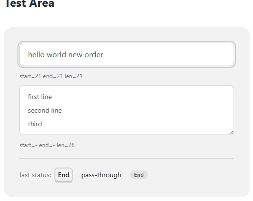

# Razorshell

This is a browser extension that adds bash shell-like keyboard shortcuts to textboxes.

  

  <a href="./image/demo.webm">▶ Full demo video (webm, 20s): test area, URL policy probe, rebinding</a>

## Features

<!-- markdownlint-disable md013 -->

### Implemented

These work today. `Alt` + `f` and `Alt` + `b` also respond to the `Esc`,`f` and
`Esc`,`b` two-stroke forms.

<!-- keymap:implemented:start -->

| Shortcut     | Description                           |
| ------------ | ------------------------------------- |
| `Ctrl` + `a` | move cursor to the beginning          |
| `Ctrl` + `b` | move cursor to the previous character |
| `Ctrl` + `e` | move cursor to the end                |
| `Ctrl` + `f` | move cursor to the next character     |
| `Ctrl` + `k` | delete to the end of the line         |
| `Ctrl` + `u` | delete to the beginning of the line   |
| `Alt` + `b`  | move cursor to the previous word      |
| `Alt` + `f`  | move cursor to the next word          |

<!-- keymap:implemented:end -->

### Planned (not implemented yet)

Listed for reference; none of these are wired up.

| Shortcut         | Description                           |
| ---------------- | ------------------------------------- |
| `Ctrl` + `c`     | Exit text box                         |
| `Ctrl` + `l`     | clear screen                          |
| `Ctrl` + `p`     | previous history                      |
| `Ctrl` + `r`     | reverse search history                |
| `Ctrl` + `y`     | Paste the yanked                      |
| `Ctrl` + `\`     |                                       |
| `Ctrl` + `[`     |                                       |
| `Ctrl` + `]`     | character search                      |
| `Ctrl` + `_`     | Redo                                  |
| `Ctrl` + `?`     |                                       |
| `Ctrl` + `@`     |                                       |
| `Ctrl` + `Space` |                                       |
| `Alt` + `p`      | non incremental reverse serch history |
| `Alt` + `u`      | up case word                          |
| `Alt` + `l`      | down case word                        |
| `Alt` + `d`      | kill word                             |
| `Alt` + `c`      | change to capital                     |
| `Alt` + `.`      | yank last arg                         |

reference `bind -p | grep -E '^"\\(e|C)'`

<!-- markdownlint-enable md013 -->

- [⛔] Browser tab-related shortcuts are reserved and cannot be overwritten
  - [Certain Chrome shortcuts cannot be overridden](https://developer.chrome.com/docs/extensions/reference/api/commands#key-combinations)
- [🚧] URL allow/deny list
  - changeable allow list mode or deny list mode
- [🚧] Verify shortcut registered and make alart
  - [verify commands registered](https://developer.chrome.com/docs/extensions/reference/api/commands?hl=en#verify_commands_registered)
